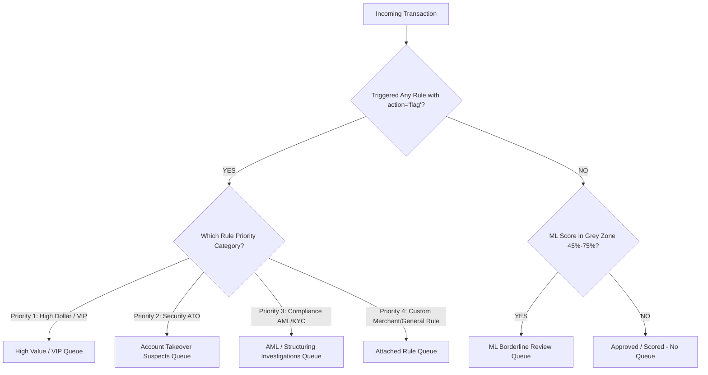

# Aegis Queue & Routing Configuration: Business Rules & Mapping Architecture

This document defines the complete business logic, queue taxonomy, and deterministic mapping rules for how flagged transactions are routed to manual review queues in the Aegis platform.

---

## 1. Complete Queue Taxonomy (Existing & Recommended)

Currently, Aegis has **5 core queues**. For a production-grade banking/fintech risk engine, we recommend adding **2 additional queues** to cover customer disputes and VIP SLAs, plus **1 fallback queue**.

### Table 1: Standard & Recommended Queues (with IST Coverage)

| # | Queue Name | Routing Strategy | SLA Target | Coverage (IST) | Primary Use Case & Alert Trigger |
|---|---|---|---|---|---|
| 1 | **ML Borderline Review** | `Round Robin` | **60m** | **24/7** (`00:00–23:59`) | Transactions falling in the ML model's "grey zone" (e.g., fraud probability 45%–75%). Used to prevent false positives and collect labeled feedback for model retraining. |
| 2 | **AML / Structuring Investigations** | `Skill Based` | **1440m** (24h) | **09:00–18:00** (Mon–Sat) | Compliance and regulatory alerts (e.g., smurfing/structuring, sudden spike in international wire transfers, PEP matching). Requires certified AML analysts and potential SAR (Suspicious Activity Report) filing. |
| 3 | **KYC & Onboarding Escalations** | `Manual` | **120m** (2h) | **09:00–21:00** (Mon–Sat) | Identity verification mismatches, synthetic identity flags, or high-risk origin countries during signup or first transaction. |
| 4 | **Account Takeover (ATO) Suspects** | `Round Robin` | **30m** | **24/7** (`00:00–23:59`) | Velocity and behavioral anomalies indicating compromised credentials (e.g., password change followed immediately by withdrawal, new device + new IP in unfamiliar location). |
| 5 | **High Value Transactions** | `Skill Based` | **15m** | **24/7** (`00:00–23:59`) | High-dollar transactions exceeding strict thresholds (e.g., amount > $10,000 or ₹5,00,000). Requires senior analyst approval to minimize customer friction while protecting funds. |
| 6 | **[NEW] Chargeback & Dispute Review** | `Skill Based` | **240m** (4h) | **09:00–18:00** (Mon–Sat) | Transactions flagged due to friendly fraud risk, merchant disputes, or recurring chargeback velocity. |
| 7 | **[NEW] VIP / White-Glove Support** | `Round Robin` | **10m** | **24/7** (`00:00–23:59`) | Ultra-high-net-worth or critical enterprise accounts whose transactions must be manually cleared almost immediately to preserve customer experience. |
| 8 | **[NEW] Default Fallback Queue** | `Round Robin` | **60m** | **24/7** (`00:00–23:59`) | Safety net queue for any unassigned rules or system escalations to guarantee zero dropped cases. |


---

## 2. Business Logic: How Escalated Transactions Map to Queues

A transaction is marked as `Escalated` in Aegis through two primary detection engines:
1. **Deterministic Rules Engine (`rules` table)**
2. **Machine Learning Model Scoring (`fraud_results` table)**

### 2.1 Compulsory Rule-to-Queue Binding (Deterministic Rules)
As mandated by system policy, **every rule created with an action of `flag` MUST be explicitly linked to a target Queue (`queue_id`) at creation time**.
* When a transaction is ingested and evaluated by the Rules Engine, if a Rule with `action == "flag"` evaluates to `TRUE`:
  * `transaction.status` is set to `'escalated'`.
  * `transaction.queue_id` is set to `rule.queue_id`.

#### Why is this reliable?
Because it is **impossible** in the UI/API to create a Flag Rule without attaching a `queue_id`, every rule-based escalation has a 100% deterministic mapping to a specific queue.

---

### 2.2 ML Score Grey-Zone Mapping (Probabilistic Scoring)
If a transaction passes all deterministic rules without triggering a Flag or Block, but is evaluated by the Machine Learning Model:
* **High Fraud Score (`score >= 0.75`):** Automatically blocked (`auto_blocked`).
* **Low Fraud Score (`score < 0.45`):** Cleared (`scored` / `approved`).
* **Grey Zone Score (`0.45 <= score < 0.75`):** Automatically marked as `escalated` and routed directly to the **ML Borderline Review** queue (`queue_id = <ML Borderline Review Queue ID>`).

---

## 3. Escalation Identification & Priority Matrix

When a transaction triggers multiple conditions simultaneously, Aegis uses a **Strict Precedence Hierarchy** to determine its **single target queue**:



### 3.1 Mapping Rule Matrix by Escalation Reason

| Escalation Reason / Trigger | Detection Source | Target Queue | SLA Target | Why mapped here? |
|---|---|---|---|---|
| **Rule: Amount > $10,000 / ₹5,00,000** | Rule Engine | `High Value Transactions` | 15m | High dollar risk requires immediate clearance by a senior analyst. |
| **Rule: Password Reset + Immediate Withdrawal** | Rule Engine | `Account Takeover Suspects` | 30m | High risk of unauthorized account access; fast SLA prevents drain. |
| **Rule: 5+ Transfers to High-Risk Country in 24h** | Rule / Velocity | `AML / Structuring Investigations` | 1440m | Requires regulatory background check and potential SAR documentation. |
| **Rule: Mismatched Govt ID / New Account Flag** | Rule Engine | `KYC & Onboarding Escalations` | 120m | Requires human document inspection before account activation. |
| **ML Score: 0.58 (Grey Area)** | ML Model | `ML Borderline Review` | 60m | Model is uncertain; analyst review provides feedback loop for AI retraining. |

---

## 4. How Administrators Can Verify Mapping in Real-Time

1. **Rule Configuration Check:** In the **Rules & Velocity** page, every table row for a rule with `Flag` action will display a badge showing its bound target queue (e.g., `Queue: High Value Transactions`).
2. **Transaction Ledger View:** In the **Transaction Ledger** page, selecting any transaction with status `Escalated` will show:
   * **Escalation Source:** `Rule: High Value Threshold` or `ML Model: Score 0.62`.
   * **Assigned Queue:** `High Value Transactions`.
   * **Review Status:** `Escalated` (Read-only for Admin; no Legit/Fraud action buttons).

---

## 5. Detailed Queue Mapping Rules & Enforcement Situations (All 8 Queues)

This section provides the comprehensive business specification for each queue: exactly what type of transaction is routed there, the precise rule or situation that enforces the escalation, and the operational reason for the queue assignment.

---

### 5.1 ML Borderline Review (`60m` SLA | 24/7 Coverage)
* **Type of Escalated Transactions:**
  * Retail e-commerce payments, card transactions, or P2P transfers that do not violate any hard deterministic rules, but exhibit subtle, multi-dimensional statistical anomalies.
* **Enforcing Rule / Situation:**
  * **ML Probabilistic Scoring Condition:**
    ```sql
    fraud_score >= 0.45 AND fraud_score < 0.75
    AND status != 'auto_blocked'
    AND triggered_rule_queue_id IS NULL
    ```
* **Why Sent Here:**
  * The machine learning model is uncertain whether the transaction is fraudulent or legitimate. Routing to an analyst prevents false declines on valid customers while capturing human-labeled decisions (`confirmed_fraud` vs `legitimate`) to retrain and improve ML model accuracy.

---

### 5.2 AML / Structuring Investigations (`1440m` / 24h SLA | 09:00–18:00 Mon–Sat)
* **Type of Escalated Transactions:**
  * Transactions suspected of smurfing (structuring payments below mandatory reporting thresholds), rapid cross-border remittances to high-risk jurisdictions, or transactions involving Politically Exposed Persons (PEPs).
* **Enforcing Rule / Situation:**
  * **Rule AML-01 (Smurfing / Structuring Below Threshold):**
    ```sql
    COUNT(transactions) WHERE amount >= 45000 AND amount <= 49999
    WITHIN WINDOW 24h >= 3
    ```
  * **Rule AML-02 (High-Risk Country Wire Transfer):**
    ```sql
    channel = 'wire' AND destination_country_code IN ('KP', 'IR', 'SY', 'MM')
    ```
  * **Rule AML-03 (PEP Watchlist Match):**
    ```sql
    account.is_pep = TRUE AND amount >= 100000
    ```
* **Why Sent Here:**
  * Mandated by Anti-Money Laundering (AML) and Prevention of Money Laundering Act (PMLA) regulations. Certified compliance officers must conduct historical ledger audits and determine whether to file a regulatory Suspicious Activity Report (SAR).

---

### 5.3 KYC & Onboarding Escalations (`120m` / 2h SLA | 09:00–21:00 Mon–Sat)
* **Type of Escalated Transactions:**
  * First-time transactions from newly registered accounts, accounts with pending government ID verification, or transactions flagged for synthetic identity patterns.
* **Enforcing Rule / Situation:**
  * **Rule KYC-01 (Unverified Account High Initial Tx):**
    ```sql
    account.age_days <= 1 AND amount >= 25000 AND account.kyc_status = 'pending'
    ```
  * **Rule KYC-02 (Shared Device / Synthetic ID Alert):**
    ```sql
    device_id_shared_accounts_count >= 5 AND action = 'flag'
    ```
  * **Rule KYC-03 (Document Verification Mismatch):**
    ```sql
    account.kyc_status = 'mismatch_flagged' AND amount > 0
    ```
* **Why Sent Here:**
  * Account identity is unverified or suspicious. Analysts inspect government ID uploads, PAN/Aadhaar proof verification logs, and biometric match scores before authorizing transaction clearance.

---

### 5.4 Account Takeover (ATO) Suspects (`30m` SLA | 24/7 Coverage)
* **Type of Escalated Transactions:**
  * Withdrawals, transfers, or profile modifications occurring immediately after sensitive credential changes (password reset, MFA device change) or from unfamiliar devices/locations.
* **Enforcing Rule / Situation:**
  * **Rule ATO-01 (Password Reset + Immediate Withdrawal):**
    ```sql
    time_since_password_reset_minutes <= 30
    AND transaction_type IN ('withdrawal', 'wire', 'p2p_transfer')
    ```
  * **Rule ATO-02 (Impossible Travel / Geo-Velocity):**
    ```sql
    geo_distance_from_last_tx_km > 2000 AND time_since_last_tx_hours < 2
    ```
  * **Rule ATO-03 (New Device High-Velocity Drain):**
    ```sql
    is_new_device = TRUE AND velocity_24h_count >= 10
    ```
* **Why Sent Here:**
  * Indicates compromised credentials or session hijacking. A fast SLA (`30m`) is critical to freeze account outflows before the attacker drains customer funds.

---

### 5.5 High Value Transactions (`15m` SLA | 24/7 Coverage)
* **Type of Escalated Transactions:**
  * Large-value domestic or international payments that exceed institutional risk thresholds.
* **Enforcing Rule / Situation:**
  * **Rule HVT-01 (High-Value INR Threshold Flag):**
    ```sql
    currency = 'INR' AND amount >= 500000 AND action = 'flag'
    ```
  * **Rule HVT-02 (High-Value International Transfer):**
    ```sql
    currency IN ('USD', 'EUR', 'GBP') AND amount >= 10000 AND action = 'flag'
    ```
  * **Rule HVT-03 (Sudden Large Outflow vs Monthly Average):**
    ```sql
    amount >= (account.avg_monthly_balance * 3) AND amount >= 100000
    ```
* **Why Sent Here:**
  * Large transactions represent substantial financial liability. Requires immediate sign-off (`15m`) by a senior credit or risk analyst to verify authorization without delaying legitimate high-value business transfers.

---

### 5.6 Chargeback & Dispute Review (`240m` / 4h SLA | 09:00–18:00 Mon–Sat) [NEW]
* **Type of Escalated Transactions:**
  * Transactions flagged due to friendly fraud risk, recurring cardholder dispute claims, or merchants exhibiting high chargeback ratios.
* **Enforcing Rule / Situation:**
  * **Rule DSP-01 (Recurring Customer Dispute Velocity):**
    ```sql
    account.disputes_count_180d >= 3 AND transaction_type = 'card_payment'
    ```
  * **Rule DSP-02 (High-Chargeback Merchant Alert):**
    ```sql
    merchant.chargeback_rate_30d > 0.015 AND amount >= 10000
    ```
  * **Rule DSP-03 (3DS Authenticated Dispute / Friendly Fraud):**
    ```sql
    is_disputed = TRUE AND is_3ds_authenticated = TRUE
    ```
* **Why Sent Here:**
  * Requires operational investigation into proof-of-delivery, 3D-Secure authentication trails, and merchant billing agreements to resolve whether a dispute is valid or fraudulent.

---

### 5.7 VIP / White-Glove Support (`10m` SLA | 24/7 Coverage) [NEW]
* **Type of Escalated Transactions:**
  * Any flagged transaction initiated by Ultra-High-Net-Worth Individuals (UHNWI), Wealth Management clients, or Tier-1 Corporate Treasury accounts.
* **Enforcing Rule / Situation:**
  * **Rule VIP-01 (VIP Account Flag Override):**
    ```sql
    account.tier IN ('VIP_GOLD', 'ENTERPRISE_PLATINUM')
    AND (fraud_score >= 0.45 OR rule_triggered = TRUE)
    ```
  * **Rule VIP-02 (Corporate Treasury Large Disbursement):**
    ```sql
    account.is_treasury = TRUE AND amount >= 5000000
    ```
* **Why Sent Here:**
  * Delays or false declines on VIP and corporate accounts cause severe customer dissatisfaction and financial churn. This queue routes to dedicated senior white-glove analysts who prioritize clearance within 10 minutes.

---

### 5.8 Default Fallback Queue (`60m` SLA | 24/7 Coverage) [NEW]
* **Type of Escalated Transactions:**
  * Any escalated transaction or system alert where the triggering rule was not assigned an explicit target queue, or where an unexpected exception occurred during queue assignment.
* **Enforcing Rule / Situation:**
  * **Rule FBK-01 (Unassigned Rule Catch-All):**
    ```sql
    status = 'escalated' AND queue_id IS NULL
    ```
  * **Rule FBK-02 (Routing Exception / DLQ Fallback):**
    ```sql
    routing_error IS NOT NULL AND status = 'escalated'
    ```
* **Why Sent Here:**
  * Serves as a 24/7 safety net across the Aegis platform to guarantee that **zero escalated cases are dropped or un-monitored**, even during configuration changes or system errors.

