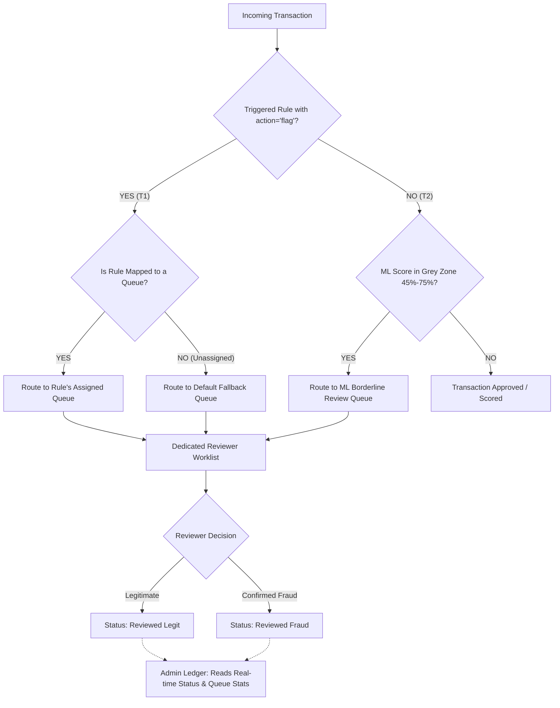

# Aegis Complete Queue Routing & Reviewer Assignment Workflow

This reference document defines the complete end-to-end workflow for how transactions are flagged, routed to the 8 manual review queues, assigned to dedicated Reviewers, and monitored by Administrators in the Aegis platform.

---

## 1. Core Principles & Architecture

1. **8 Dedicated Queues & Reviewer Assignments:**
   * The system maintains **8 distinct manual review queues**.
   * Each queue is assigned a dedicated **Reviewer** (analyst) who is responsible for investigating cases in their queue.
   * A Reviewer only sees and reviews transactions routed to their explicitly assigned queue(s).
2. **Optional Rule-to-Queue Mapping with Fallback Safety Net:**
   * When an Administrator creates a Flag Rule, mapping it to a specific queue is **optional**.
   * **Rule with Queue Mapping:** If a rule has an attached `queue_id`, any transaction triggering that rule is routed directly to that queue.
   * **Rule without Queue Mapping:** If a rule does **not** have an attached `queue_id` (unassigned rule), the transaction is automatically routed to the **Default Fallback Queue** to guarantee zero dropped cases.
3. **Strict Role-Based Limitations (Separation of Duties):**
   * **Admin Role:** Configures rules, queues, and velocity parameters. In the Transaction Ledger and Queue Config dashboards, Admins have **READ-ONLY** access to real-time `open_cases` counts and statuses. Admins **cannot** mark escalated transactions as `Legit` or `Fraud`.
   * **Reviewer Role:** Investigates escalated transactions inside their assigned queue and has sole authority to submit human review decisions (`Legit` / `Fraud`).

---

## 2. End-to-End Workflow Diagram

---

## 3. Transaction Pathways (Workflow Walkthrough)

### 3.1 Pathway T1: Rule-Based Escalation (Deterministic Rule System)
1. **Ingestion & Rule Evaluation:**
   * Transaction **T1** enters the Aegis ingestion engine and triggers a Rule with `action = 'flag'`.
   * The system marks `T1.status = 'escalated'`.
2. **Queue Assignment Logic:**
   * **Case A (Mapped Rule):** If the triggered rule was mapped by Admin to *Queue #5 (High Value Transactions)*, `T1` is routed to `High Value Transactions`.
   * **Case B (Unmapped Rule):** If the rule has no `queue_id` attached, `T1` is automatically routed to *Queue #8 (Default Fallback Queue)*.
3. **Dedicated Reviewer Dashboard:**
   * The Reviewer assigned to that specific queue sees `T1` in their queue worklist.
   * Reviewers assigned to *other* queues do **not** see `T1` in their review queue.
4. **Human Review Decision:**
   * The assigned Reviewer inspects `T1` and clicks **Legit** or **Fraud**.
   * The transaction status updates to `Reviewed Legit` or `Reviewed Fraud`, and `open_cases` count for that queue decreases by 1.
5. **Admin Monitoring:**
   * The Admin sees the live queue count change in **Queue Config** and views the final updated badge (`Reviewed Legit/Fraud`) in the **Transaction Ledger**, without ever having review action buttons.

---

### 3.2 Pathway T2: ML Model Escalation (Probabilistic Scoring System)
1. **Ingestion & Rule Evaluation:**
   * Transaction **T2** enters the system and **passes** all deterministic rules without triggering a Flag or Block.
2. **ML Fraud Evaluation:**
   * The ML Fraud Model evaluates `T2` and computes a fraud probability score in the **Grey Zone** (`0.45 <= score < 0.75`, e.g., score `0.61`).
3. **Queue Assignment Logic:**
   * Because the AI model is uncertain, `T2` is automatically routed to *Queue #1 (ML Borderline Review)* (`T2.status = 'escalated'`, `T2.queue_id = ML Borderline Review Queue ID`).
4. **Dedicated Reviewer Dashboard:**
   * The Reviewer dedicated to the **ML Borderline Review** queue sees `T2` in their worklist.
5. **Human Review Decision & AI Feedback Loop:**
   * The Reviewer uses human domain knowledge to classify `T2` as **Legit** or **Fraud**.
   * Besides updating the transaction status, this decision acts as ground-truth training data to retrain and improve the ML model.

---

## 4. Role Limitations & Separation of Duties Matrix

| Feature / Action | Admin Role | Reviewer Role | Viewer Role |
|---|---|---|---|
| **Create / Edit / Delete Rules** | ✅ **Full Control** | ❌ Forbidden | ❌ Forbidden |
| **Create / Configure / Delete Queues** | ✅ **Full Control** | ❌ Forbidden | ❌ Forbidden |
| **Assign Users / Reviewers to Queues** | ✅ **Full Control** | ❌ Forbidden | ❌ Forbidden |
| **View Real-Time Queue Stats (`open_cases`)** | ✅ **Read-Only** | ✅ **Reads Assigned Queue** | ✅ **Read-Only** |
| **View Transaction Ledger Details** | ✅ **Read-Only** | ✅ **Read-Only** | ✅ **Read-Only** |
| **Submit Review Decision (`Legit` / `Fraud`)** | ❌ **Forbidden (No Buttons / 403 API)** | ✅ **Sole Authority (Assigned Queue)** | ❌ Forbidden |
