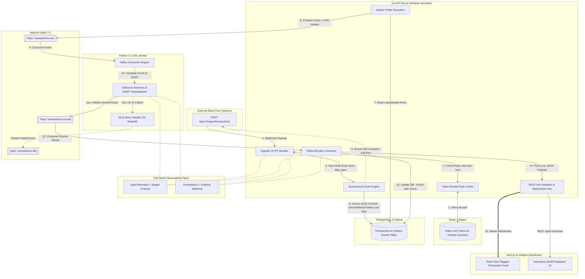

<div align="center">

# 🛡️ Aegis — Real-Time Fraud Detection System

**Production-Grade Event-Driven Fraud Detection Pipeline**

> Built for high-throughput, sub-millisecond scoring with end-to-end observability. Every transaction flows through a durable **Apache Kafka** pipeline, gets scored by an **XGBoost ML** model with **SHAP explainability**, and surfaces on a live analyst dashboard in real time via **WebSocket** — monitored with **OpenTelemetry**, **Prometheus**, and **Grafana** across all microservices.

<br />

<p align="center">
  
  
  
  
  
  <br />
  
  
  
  
  
  
</p>

</div>

---

## 1. Problem Statement

Financial institutions process millions of transactions per second across card networks, UPI rails, and net-banking channels. Operating at this velocity requires sub-millisecond intake without degrading checkout experience, yet traditional fraud detection architectures fail in one of two fundamental ways.

### Why Static Rule Engines Fail

- **Enormous False-Positive Rates:** Deterministic thresholds block legitimate customers at checkout, damaging merchant conversion rates and customer retention.
- **Zero-Day Vulnerability:** Rules cannot generalize to novel or mutating attack campaigns (e.g., payment testing, sophisticated ATO) not anticipated when the rules were authored.
- **High Maintenance Overhead:** Maintained manually by risk teams; every new fraud vector requires a rule deployment and regression testing.
- **Zero Contextual Awareness:** A ₹50,000 purchase is routine for a high-net-worth customer but highly anomalous for a dormant account.

### Why Batch Machine Learning Fails

- **Post-Transaction Latency:** Fraud is detected hours or days after the transaction settles — the funds are already withdrawn or transferred.
- **No Real-Time Actionability:** Cannot trigger live auto-blocking, dynamic customer verification, or instant analyst alerts.
- **Model Staleness:** Offline models degrade quickly against adversarial attack campaigns that evolve faster than batch retraining schedules.

### The Real Engineering Problem

> **Detect anomalous transaction sequences in real-time (sub-100ms end-to-end)**, with calibrated confidence scores and per-prediction explainability, while maintaining a false-positive rate low enough that legitimate customers are not disrupted — all in a system that survives service failures **without losing a single event**.

---

## 2. Solution Overview

An event-driven, three-service architecture where every transaction flows through a durable **Apache Kafka** pipeline, gets scored by an **XGBoost** machine-learning worker with **SHAP explainability**, and surfaces on an analyst dashboard in real time via **WebSocket** — with end-to-end distributed tracing propagated through Kafka message headers so any latency bottleneck is immediately observable.

| Service | Technology | Role & Capabilities |
|---|---|---|
| **Go API Server** | **Go 1.26.4** | Receives transaction events via REST (`/api/v1/ingest/transactions`), writes to PostgreSQL and the outbox table atomically, publishes to Kafka via the **Transactional Outbox Pattern**, and serves the analyst REST API and WebSocket hub. |
| **Python ML Worker** | **Python 3.12** | Consumes from `transactions.raw`, engineers velocity and behavioral features, runs XGBoost inference, computes per-feature **SHAP (TreeExplainer)** contribution weights, and publishes scored results to `transactions.scored`. |
| **Next.js Dashboard** | **Next.js 16** | Analyst-facing TypeScript web application. Connects via native WebSocket for live flagged transaction feeds, displays SHAP feature-weight charts, and supports manual review actions with RBAC. |

> [!IMPORTANT]
> **Key Design Guarantees:**
> 1. **Sub-5ms Ingestion Guarantee:** The ingestor endpoint always responds in under **5ms** — it never blocks on ML inference.
> 2. **Zero Event Loss:** The Transactional Outbox Pattern guarantees that even if the API server crashes immediately after writing to the database, the event is preserved and published to Kafka upon recovery.
> 3. **Full-Stack Observability:** OpenTelemetry trace contexts (`traceparent` headers) are injected into Kafka message headers, allowing seamless distributed tracing across Go, Python, and Next.js in Jaeger and Grafana.

---

## 3. Features

Aegis delivers a complete, production-grade feature set organized across five core engineering categories:

### 🚀 Ingestion & Distributed Transaction Resilience

| Feature | Description |
|---|---|
| **High-Throughput Webhook Ingestor** | REST webhook endpoint (`POST /api/v1/ingest/transactions`) simulating real-time bank core systems with a guaranteed **`<5ms` response SLA**. |
| **Synchronous Rule Evaluation** | Immediately evaluates incoming transactions against deterministic rules for real-time routing (block, flag, or pass) within the same DB transaction. |
| **Transactional Outbox & Parallel Relay** | Eliminates dual-write bugs by writing an outbox event atomically. Unconditionally relays *every* transaction to Kafka, ensuring rules and ML run in parallel. |
| **Dead-Letter Queue (DLQ) Resilience** | Transactions failing ML scoring after 3 exponential backoff retries are published to `transactions.dlq` for admin inspection and replay. |
| **Graceful Shutdown & Drain Window** | API server intercepts `SIGTERM` / `SIGINT` signals with a 30-second drain window, completing in-flight database transactions and closing connections cleanly. |

### 🧠 ML Fraud Scoring & Explainability Engine

| Feature | Description |
|---|---|
| **Parallel ML Risk Enrichment** | The ML worker scores every transaction (even rule-blocked ones) to eliminate selection-bias, enrich queued cases, and prioritize analyst worklists highest-risk-first. |
| **Real-Time XGBoost Inference** | Sub-10ms classification inference utilizing engineered transaction velocity, frequency, and behavioral aggregations. |
| **Continuous Confidence Scoring** | Fraud probability is displayed as a continuous probability (`0.00` to `1.00`) instead of a binary threshold flag. |
| **SHAP (`TreeExplainer`) Explainability** | Every scored transaction computes exact Shapley Additive Explanations, showing analysts the precise positive and negative feature contribution weights. |
| **Model Artifact Versioning** | Each `fraud_result` record stores the exact model version ID, enabling rigorous A/B testing, model drift auditing, and reproducibility. |

### 🖥️ Real-Time Analyst Dashboard & Review Workflows

| Feature | Description |
|---|---|
| **Smart Queuing & Borderline Escalation** | Routes cases via priority hierarchy (VIP, ATO). Pending transactions with borderline ML scores are dynamically escalated to a dedicated ML Borderline Review queue. |
| **Symmetric SLAs & Incident Tracking** | Differentiates honest manual rejects (rewarded with a full fresh SLA) from negligent silent breaches (penalized with reduced SLA and an incident logged against the reviewer). |
| **Reject Capping & Admin Escalation** | Prevents indefinite queue-bouncing by capping reviewer rejects at 2, force-escalating the case to an Admin for a mandatory claim. |
| **Live WebSocket Flagged Feed** | Connected analyst browsers receive instant WebSocket push notifications whenever a transaction is flagged, eliminating page polling. |
| **Interactive SHAP Visualizer** | Feature-weight bar charts in the UI clearly explain the mathematical driver behind every flagged transaction. |
| **RBAC Manual Review Actions** | Authenticated analysts can mark transactions as `confirmed_fraud`, `false_positive`, or `escalated` with Role-Based Access Control. |

### 🔒 Enterprise Security & Governance

| Feature | Description |
|---|---|
| **Block Audit Sampling** | A continuous feedback loop that pushes a subset of auto-blocked transactions into an audit queue, allowing humans to catch false positives and tune aggressive rules. |
| **Redis Token-Bucket Rate Limiting** | Per-API-key token-bucket limiter on the ingestor endpoint returning `429 Too Many Requests` with RFC-compliant `Retry-After` headers. |
| **Runtime-Configurable Thresholds** | Admin UI to update rule thresholds and configs live in PostgreSQL + Redis cache without service redeployments. |
| **Immutable Audit Logging** | Every analyst review decision, SLA breach, and threshold modification is logged with timestamp, analyst UUID, and originating IP address. |
| **Strict API Versioning** | All backend endpoints are structured under `/api/v1/`, ensuring seamless backward compatibility for future client integrations. |

### 📊 Full-Stack Observability & Telemetry

| Feature | Description |
|---|---|
| **OpenTelemetry Distributed Tracing** | End-to-end W3C `traceparent` context propagation across Go HTTP ingest, Kafka message headers, and Python ML worker inference spans. |
| **Prometheus Metrics Exporter** | Scrapes rich system metrics including `transactions_ingested_total`, `fraud_score_histogram`, `ml_inference_duration_seconds`, and `kafka_consumer_lag`. |
| **Pre-Configured Grafana Dashboards** | Ready-to-use Grafana dashboard provisioning JSON included in the repo for real-time visual telemetry and lag alerting. |
| **Structured Zero-Allocation Logging** | Go (`zerolog`) and Python (`structlog`) emit structured JSON log lines enriched with `trace_id`, `transaction_id`, `service`, and `level`. |

---

## 4. Tech Stack

| Layer | Technology & Version | Core Libraries, Frameworks & Architectural Purpose |
|---|---|---|
| **Go API Server** | **Go 1.26.4** | `chi/v5` (routing), `pgx/v5` (PostgreSQL connection pooler), `go-redis/v9` (Redis client), `confluent-kafka-go` (librdkafka C-bindings), `golang-jwt/v5` (JWT authentication), `zerolog` (structured JSON logging), `prometheus/client_golang` (metrics), `go.opentelemetry.io/otel` (tracing). |
| **Python ML Worker** | **Python 3.12** | `FastAPI` (health & admin endpoints), `scikit-learn` (feature engineering pipelines), `XGBoost` (gradient boosted classifier), `SHAP` (`TreeExplainer` for real-time explainability), `joblib` (model serialization), `confluent-kafka-python`, `structlog`, `opentelemetry-sdk`. |
| **Analyst Dashboard** | **Next.js 16** | `React 19`, `TypeScript 5`, `Next.js 16 (App Router)`, `Tailwind CSS`, `shadcn/ui`, `Lucide Icons`, `React Query / TanStack Query` (state & caching), `Recharts` (charts), native browser `WebSocket` client. |
| **Message Broker** | **Apache Kafka 7.5.0** <br /> *(Zookeeper 7.5.0)* | Highly durable, partitioned event streaming across `transactions.raw`, `transactions.scored`, and `transactions.dlq`. Supports horizontal ML worker scaling via consumer groups. |
| **Primary Database** | **PostgreSQL 15-alpine** | ACID-compliant relational database for transactions, outbox events, fraud results, analyst reviews, immutable audit logs, model versions, and system configurations. |
| **In-Memory Cache** | **Redis 7-alpine** | Sub-millisecond token-bucket rate limiting, account velocity counters (sorted sets), user session storage, and runtime configuration caching. |
| **Distributed Tracing** | **OpenTelemetry + Jaeger 1.57** | Full-stack distributed trace collection and visualization across Go HTTP handlers, Kafka headers, and ML inference execution spans. |
| **Metrics & Monitoring** | **Prometheus v2.51.2** <br /> **Grafana 10.4.2** | Time-series metrics scraping and visual dashboards for latency histograms, ingest TPS, consumer lag, and WebSocket connection counts. |
| **Containerization** | **Docker + Docker Compose v2** | Complete multi-container local production stack orchestration (`postgres`, `redis`, `zookeeper`, `kafka`, `jaeger`, `prometheus`, `grafana`, `api-server`, `ml-worker`, `dashboard`). |
| **Dev & Demo Tools** | **Kafka UI (Provectus)** | Visual topic browser, consumer group lag monitor, and message inspector for development and live demonstrations. |

---

## 5. System Architecture

Aegis is architected as an asynchronous, event-driven pipeline designed to decouple sub-millisecond transaction ingestion from intensive machine learning inference. Below is the end-to-end data flow and structural layout of the system:



### End-to-End Transaction Lifecycle

#### Phase 1: Sub-Millisecond Ingestion, Rules & Atomic ACID Persistence (Sub-5ms Ingest SLA)
1. **Webhook Reception:** Bank core payment systems push structured transaction JSON payloads to `POST /api/v1/ingest/transactions`.
2. **Rate Limit & Velocity Validation:** The Go ingestor validates the API key against a Redis 7 token-bucket rate limiter in `<1ms`. If the bucket is exhausted, it returns `429 Too Many Requests` with an RFC-compliant `Retry-After` header.
3. **Synchronous Rule Evaluation:** The payload is evaluated against deterministic rules in-memory, immediately determining the base action (`block`, `flag`, or `pass`) and setting the initial transaction status (`auto_blocked`, `escalated`, or `pending`).
4. **Atomic Outbox Write (Unconditional Relay):** Using a single ACID PostgreSQL transaction (`pgx/v5`), the server commits the transaction row with its rule-assigned status and *always* simultaneously writes an event payload into `outbox_events`. There is no `skipML` logic.
5. **Immediate Decoupled Response:** The server acknowledges the request with an HTTP `202 Accepted` status code in **under 5 milliseconds**, ensuring bank payment checkouts never block waiting for ML inference.

#### Phase 2: Event Streaming & Asynchronous XGBoost Inference
6. **Outbox Poller Publication:** A dedicated background goroutine continuously polls the `outbox_events` table for unpublished rows, publishing each event to Apache Kafka topic `transactions.raw` while injecting W3C `traceparent` OpenTelemetry trace context into the Kafka message headers.
7. **Feature Engineering & Inference:** The Python 3.12 ML Worker consumes from `transactions.raw`, engineers velocity and behavioral features, and passes the feature vector to an XGBoost gradient boosted classifier.
8. **SHAP Contribution Calculation:** For every scored transaction, `TreeExplainer` calculates precise Shapley Additive Explanations (SHAP), quantifying the positive and negative contribution weight of each feature toward the fraud probability score (`0.00–1.00`).
9. **Scored Event Publishing:** The worker publishes the scored payload (including `risk_score`, `risk_band`, and `shap_values`) to Kafka topic `transactions.scored`. If inference fails after 3 exponential backoff retries, the event is automatically routed to `transactions.dlq`.

#### Phase 3: Real-Time Governance, Database Synchronization & WebSocket Push
10. **Result Consumption:** The Go API Server `Results Consumer` goroutine subscribes to `transactions.scored`.
11. **State-Machine Transition (Parallel Enrichment):** The server updates the PostgreSQL `transactions` table row with the computed ML score. If the transaction was `pending` and the score is high, it escalates to the `ML Borderline Review` queue. If already `escalated` by rules, the score re-sorts the queue (highest risk first). If `auto_blocked` by rules, the score is evaluated for `block_audit_samples` anomaly detection.
12. **Real-Time Analyst Alerting:** If a transaction is flagged (`escalated` or `auto_blocked`), the Go native WebSocket hub broadcasts an immediate JSON event to all connected Next.js 16 analyst browsers, rendering the flagged transaction and SHAP feature bar chart in real time without page refreshing.

#### Phase 4: Full-Stack Observability & Distributed Trace Continuity
13. **Trace & Metric Correlation:** Because OpenTelemetry W3C trace headers are injected by Go into Kafka metadata and extracted by Python, Jaeger visualizes an unbroken distributed trace across HTTP handlers, Kafka brokers, and ML inference spans. Meanwhile, Prometheus scrapes live runtime metrics across both services for visualization in Grafana.

---

### Key Architectural Decisions

#### 1. Single Go Modular Monolith (over Microservice Fragmentation)
- **Decision:** Consolidate all Go responsibilities — REST webhook ingestion, Transactional Outbox polling, Kafka result consumption, analyst REST APIs, and native WebSocket hub — into a single modular binary with strict internal package boundaries (`/internal/ingest`, `/internal/outbox`, `/internal/ws`, `/internal/api`).
- **Rationale:** Microservice fragmentation at this layer would introduce inter-service HTTP/gRPC serialization overhead, distributed tracing complexity, and operational fragility without any horizontal scaling benefit.
- **Why Python is Separate:** The ML Worker is the only justified architectural boundary because Python has a different runtime execution model, distinct scaling profile (CPU/GPU inference vs. high-concurrency Go I/O), and specialized data-science dependencies (`XGBoost`, `SHAP`, `scikit-learn`).

#### 2. Transactional Outbox Pattern (over Direct Dual-Writes)
- **Decision:** Never execute direct dual-writes (`db.Exec(...)` followed by `kafka.Produce(...)`). Instead, write to the database and an outbox table in one ACID transaction.
- **Rationale:** Direct dual-writes create a catastrophic distributed race condition: if PostgreSQL commits but the service crashes before Kafka acknowledges the publish, the transaction is permanently lost. The Transactional Outbox Pattern guarantees at-least-once message delivery and zero event loss across service failures.

#### 3. Parallel Hybrid Pipeline (Rules + ML)
- **Decision:** Execute deterministic rules synchronously during ingestion, but *unconditionally* write to the outbox to ensure the ML worker scores every transaction asynchronously.
- **Rationale:** Sequential execution (where blocked/flagged transactions bypass ML) causes severe selection bias in training data and strips ML context from analyst queues. Parallel execution ensures ML scores enrich all queues and provides unbiased data for continuous retraining.

#### 4. Apache Kafka (over Redis Streams or RabbitMQ)
- **Decision:** Utilize Apache Kafka 7.5 as the primary event streaming backbone across `transactions.raw`, `transactions.scored`, and `transactions.dlq`.
- **Rationale:** While Redis Streams offers lightweight streaming, Kafka provides an immutable, partitioned, replayable commit log with robust consumer group rebalancing, horizontal partition scaling, and industry-standard consumer lag monitoring (via Kafka UI and Prometheus metrics).

#### 5. Asynchronous Non-Blocking Inference (`202 Accepted` Decoupling)
- **Decision:** Never block the REST ingestor HTTP request while waiting for ML model inference.
- **Rationale:** Synchronous ML scoring in the ingest request path couples merchant checkout conversion to data science model latency. By returning `202 Accepted` in `<5ms` immediately after DB commit, ingestion throughput scales independently of ML worker inference latency.

#### 6. OpenTelemetry Context Propagation via Kafka Message Headers
- **Decision:** Propagate W3C `traceparent` OpenTelemetry trace identifiers across Kafka message headers between Go and Python.
- **Rationale:** Standard HTTP tracing headers fail in asynchronous event-driven architectures. Injecting trace context into Kafka message headers ensures Jaeger visualizes an unbroken distributed trace across Go producers, Kafka brokers, and Python consumers.

#### 7. Native WebSocket Push (over Analyst Client Polling)
- **Decision:** Push flagged transactions and fraud alerts from the Go server to Next.js analyst browsers over persistent WebSockets.
- **Rationale:** Traditional HTTP polling (`GET /api/v1/transactions?flagged=true` every 5 seconds) degrades server performance, wastes network bandwidth, and delays critical fraud alerts. WebSockets achieve sub-second alert delivery with zero database polling overhead.

---

## 10. Real-Time Events (WebSocket)

All events are JSON objects. The hub broadcasts to all connected analysts regardless of role.

### `transaction.scored`

Emitted when the ML worker completes scoring and the result is written to DB.

```json
{
  "event": "transaction.scored",
  "data": {
    "transaction_id":    "uuid",
    "external_id":       "TXN-2025-ABC123",
    "account_id":        "ACC-98765",
    "merchant_name":     "Amazon India",
    "merchant_category": "E-Commerce",
    "amount":            45999.00,
    "currency":          "INR",
    "fraud_score":       0.923,
    "is_fraud":          true,
    "auto_blocked":      true,
    "top_features": [
      { "feature": "amount_zscore",    "weight": 0.42 },
      { "feature": "txn_velocity_1h",  "weight": 0.31 },
      { "feature": "country_mismatch", "weight": 0.18 }
    ],
    "trace_id":   "abc123def456",
    "scored_at":  "2025-03-27T14:32:01.823Z"
  }
}
```

### `alert.fraud_spike`

Emitted when fraud rate in the last 15 minutes exceeds the configured threshold.

```json
{
  "event": "alert.fraud_spike",
  "data": {
    "fraud_rate_15m": 0.087,
    "threshold":      0.05,
    "flagged_count":  34,
    "window_start":   "2025-03-27T14:15:00Z"
  }
}
```

### `transaction.reviewed`

Emitted when an analyst submits a review, so all other connected analysts see the update live.

```json
{
  "event": "transaction.reviewed",
  "data": {
    "transaction_id": "uuid",
    "decision":       "false_positive",
    "analyst_name":   "Priya Sharma",
    "reviewed_at":    "2025-03-27T14:38:00Z"
  }
}
```

### `transaction.dlq`

Emitted when the ML worker exhausts retries and sends a transaction to the DLQ.

```json
{
  "event": "transaction.dlq",
  "data": {
    "transaction_id": "uuid",
    "error":          "model inference timeout after 3 retries",
    "failed_at":      "2025-03-27T14:40:00Z"
  }
}
```

### `config.updated`

Emitted when an admin updates a runtime config value.

```json
{
  "event": "config.updated",
  "data": {
    "key":         "fraud_threshold",
    "old_value":   "0.75",
    "new_value":   "0.80",
    "updated_by":  "admin@bank.com"
  }
}
```

---

## 11. System Design Deep-Dive

### Kafka Topic Design

| Topic | Partitions | Producer | Consumer Group | Retention |
|---|---|---|---|---|
| `transactions.raw` | 3 (partitioned by `account_id` for per-account ordering) | Outbox poller | `ml-workers` | 7 days |
| `transactions.scored` | 3 | ML worker | `api-results-consumer` | 3 days |
| `transactions.dlq` | 1 | ML worker (on max retries) | `api-dlq-consumer` | 14 days |

### Outbox Pattern Flow

The Outbox Pattern solves the dual-write problem. Without it: if the API server writes to Postgres successfully but crashes before publishing to Kafka, the transaction is in the DB but never scored — silently lost from the pipeline.

```
Step 1: HTTP ingest handler begins a DB transaction.
Step 2: INSERT into transactions table.
Step 3: INSERT into outbox_events table (same transaction).
Step 4: COMMIT — both writes are atomic.
Step 5: Return 202 to caller immediately.

Background goroutine (outbox poller, runs every 500ms):
Step 6: SELECT id, payload FROM outbox_events
        WHERE published = false
        ORDER BY created_at LIMIT 100
        -- partial index makes this O(1)
Step 7: For each row: kafka.Produce(topic, payload)
Step 8: On Kafka ACK: UPDATE outbox_events
        SET published=true, published_at=NOW()
        WHERE id = ?

Idempotency on ML worker side:
  fraud_results has UNIQUE INDEX on transaction_id.
  Duplicate Kafka messages (at-least-once) result in a
  duplicate key error which the worker catches and ignores.
```

### Feature Engineering

The ML worker engineers 10 features from the raw transaction payload combined with Redis velocity counters. Velocity features are computed at inference time from Redis sorted sets — never from a slow PostgreSQL query in the hot path.

| Feature | Description | Source |
|---|---|---|
| `amount_zscore` | How many std-devs is this amount from the account's 30-day mean | Redis (account stats cache) |
| `txn_velocity_1h` | Transaction count from this `account_id` in past 1 hour | Redis `ZCOUNT` |
| `txn_velocity_24h` | Transaction count from this `account_id` in past 24 hours | Redis `ZCOUNT` |
| `country_mismatch` | Boolean: `country_code` ≠ account's home country | Redis (account profile) |
| `hour_of_day_sin` | Cyclical encoding of hour (sin component) | Transaction timestamp |
| `hour_of_day_cos` | Cyclical encoding of hour (cos component) | Transaction timestamp |
| `day_of_week_sin` | Cyclical encoding of weekday (sin component) | Transaction timestamp |
| `day_of_week_cos` | Cyclical encoding of weekday (cos component) | Transaction timestamp |
| `merchant_category_risk` | Precomputed risk score per MCC category from training data | In-memory lookup |
| `device_seen_before` | Boolean: has `device_id` appeared with this account before | Redis SET |
| `amount_vs_avg_ratio` | `amount / account 30-day average` — catches unusually large purchases | Redis (account stats cache) |

### Redis Data Structures for Velocity

```bash
# Ingestor writes on every transaction received:
ZADD acct:{account_id}:txns <unix_timestamp> <transaction_id>
EXPIRE acct:{account_id}:txns 172800   # 48-hour TTL

# ML Worker reads at inference time:
ZCOUNT acct:{account_id}:txns {now-3600}  {now}   # velocity_1h  — O(log N)
ZCOUNT acct:{account_id}:txns {now-86400} {now}   # velocity_24h — O(log N)

# Device seen before:
SADD     acct:{account_id}:devices {device_id}
SISMEMBER acct:{account_id}:devices {device_id}   # boolean check

# Runtime config cache (60s TTL, invalidated on admin update):
GET    config:fraud_threshold
DEL    config:{key}  # called by PATCH /admin/config/:key
```

### WebSocket Hub Architecture

Standard Go hub pattern with per-client buffered channels to prevent slow readers from blocking the broadcast loop.

```go
type Hub struct {
    clients    map[*Client]bool
    broadcast  chan []byte
    register   chan *Client
    unregister chan *Client
    mu         sync.RWMutex
}

type Client struct {
    conn      *websocket.Conn
    send      chan []byte  // buffered: 256
    analystID string
    role      string
}

// If client.send buffer is full (slow reader):
// Hub drops message + closes connection rather than blocking broadcast.
// Client reconnects and calls GET /stats/summary to re-sync.
```

### OTel Trace Propagation via Kafka

A single trace spans HTTP ingestion → Kafka → ML worker → result consumer → DB write. The `trace_id` is visible in Jaeger for any transaction, showing exact latency at each hop.

```go
// Go API Server (producer):
ctx, span := tracer.Start(ctx, "ingest.transaction")
propagator.Inject(ctx, KafkaHeaderCarrier(msg.Headers))
kafka.Produce(msg)
```

```python
# Python ML Worker (consumer):
ctx = propagator.extract(KafkaHeaderCarrier(msg.headers()))
with tracer.start_as_current_span("ml.score_transaction", context=ctx):
    score = predictor.predict(features)
    # This span is a CHILD of the original API server span
    # => single trace in Jaeger shows the full pipeline
```

---

## 12. Challenges & Solutions

### Challenge 1 — Feature computation requires recent transaction history

Features like `txn_velocity_1h` can't come from the transaction payload alone. A slow PostgreSQL query at inference time would destroy latency.

**Solution:** The ingestor maintains Redis sorted sets keyed by `account_id` (`ZADD` with Unix timestamp, 48h TTL). The ML worker does `ZCOUNT` to get velocity in O(log N) — sub-millisecond. No DB hit in the hot path.

---

### Challenge 2 — Outbox poller at-least-once Kafka delivery

If the server crashes after Kafka produce but before marking `published=true`, the message is re-sent on restart.

**Solution:** `fraud_results` has a `UNIQUE INDEX` on `transaction_id`. Duplicate inserts from re-processed Kafka messages are caught as constraint violations and silently skipped — idempotent by design.

---

### Challenge 3 — WebSocket slow-reader back-pressure

A naive WS hub blocks the broadcast goroutine if a client reads slowly, stalling all other clients.

**Solution:** Each client gets a buffered `send` channel (256 messages). If the buffer fills, the hub drops the message and closes that client's connection rather than blocking the broadcast loop. The client reconnects and re-syncs via `GET /stats/summary`.

---

### Challenge 4 — ML model class imbalance (3.5% fraud rate)

Training naively gives 96.5% accuracy with a useless model that predicts everything as legitimate.

**Solution:** XGBoost `scale_pos_weight = (negatives / positives)`. Threshold tuning on the validation set — the default 0.5 is wrong; the optimal threshold for F1 on this dataset is ~0.35–0.45. Target metric: **F1 on the fraud class, not accuracy**.

---

### Challenge 5 — SHAP computation latency

`TreeExplainer` SHAP for a single XGBoost sample takes 8–12ms. Re-instantiating the explainer per request would be catastrophic.

**Solution:** The SHAP explainer object is loaded **once** on worker startup alongside the model and reused for every inference call.

---

### Challenge 6 — Runtime config propagation

Fraud threshold updates need to reach all service instances without restart.

**Solution:** `system_config` table is the source of truth. Redis cache (60s TTL) sits in front. Admin `PATCH` invalidates the Redis key immediately (`DEL config:{key}`). Next inference request reads from DB and re-caches. Maximum 60s stale config window — acceptable for a risk threshold.

---

### Challenge 7 — Kafka consumer group rebalance during DLQ retry

Re-queuing a DLQ message to `transactions.raw` could cause it to be consumed by a different worker instance mid-rebalance and double-processed.

**Solution:** Idempotent processing via unique constraint on `fraud_results.transaction_id` ensures double-processing is a no-op. The re-queued message gets a new Kafka offset but the same `transaction_id`, so the DB insert is safely rejected.

---

## 13. Architecture Decision Records (ADRs)

### ADR-1: Kafka over Redis Streams

Kafka provides a durable partitioned log, consumer group management with lag monitoring, and replay capability. Redis Streams gives 90% of this with zero operational overhead.

**Decision:** Kafka, because this project specifically demonstrates event-driven architecture patterns that MAANG system design rounds probe.

**Trade-off:** Requires Zookeeper/KRaft; heavier Docker Compose setup.

**Interview answer:** *"In a startup context, Redis Streams is the correct operational choice. Kafka is correct here because it demonstrates exactly the infrastructure knowledge interviewers probe: consumer group management, partition key design, consumer lag observability, and DLQ patterns."*

---

### ADR-2: Single Go binary over microservices

All Go logic (ingestion, result consumption, REST API, WebSocket) lives in one binary with clean internal package boundaries. The ML worker is the only justified service split — different language runtime, different scaling profile, different failure mode.

**Trade-off:** Cannot scale ingestion independently from the API.

**Interview answer:** *"Splitting Go into two services for ingestion vs API would be premature — it adds inter-service HTTP calls and distributed transaction complexity for zero benefit at this scale. The Python ML worker boundary is the one that's truly justified."*

---

### ADR-3: Async scoring over synchronous

The ingestor returns `202 Accepted` in <5ms. ML inference arrives asynchronously via Kafka.

**Trade-off:** The bank caller cannot get a synchronous fraud decision in the same API response.

**Interview answer:** *"Synchronous scoring (request-reply via Kafka or gRPC) would be needed if the bank required a real-time block decision before transaction settlement. For post-hoc flagging, async is correct — it fully decouples ingestor latency from ML worker latency and means a slow or restarting ML worker never causes bank-facing timeouts."*

---

### ADR-4: XGBoost over deep learning

XGBoost is more interpretable (SHAP works cleanly), trains in minutes on a laptop, achieves competitive F1 on tabular fraud data, and requires no GPU.

**Trade-off:** Less accurate on velocity-based attack patterns with long temporal dependencies vs. an LSTM or Transformer.

**Interview answer:** *"Production answer: XGBoost for analyst-facing explainability, with a sequence model running in parallel for high-confidence auto-block decisions. For this project, XGBoost is the right call."*

---

### ADR-5: PostgreSQL + JSONB over MongoDB

SHAP `feature_weights` are stored as JSONB — flexible, schema-free. But the rest of the schema is deeply relational (`fraud_results` reference `transactions`, `reviews` reference `analysts`). PostgreSQL JSONB gives relational integrity where needed and schema flexibility where not.

**Trade-off:** JSONB queries are less ergonomic than native MongoDB document queries.

---

### ADR-6: In-memory WS hub vs. Redis Pub/Sub

Current implementation: single API server instance, hub is in-memory. If two API server instances run, a connection on server A won't receive broadcasts from server B.

**Upgrade path:** Redis Pub/Sub as a broadcast layer between instances — each server subscribes to a channel and re-broadcasts to local clients. The code structure makes this upgrade straightforward.

**Interview answer:** *"This is the correct answer to 'how would you scale the WebSocket tier?' — replace the in-memory hub with a Redis Pub/Sub fan-out layer and scale the API server horizontally."*

---

## 14. Observability

The full observability stack is included in Docker Compose and requires zero manual setup.

### Prometheus Metrics

| Metric | Type | Description |
|---|---|---|
| `transactions_ingested_total` | Counter | Total transactions received by ingest endpoint |
| `fraud_score_histogram` | Histogram | Distribution of fraud scores (buckets: 0–0.3, 0.3–0.6, 0.6–0.9, 0.9–1.0) |
| `ml_inference_duration_seconds` | Histogram | XGBoost inference latency per prediction |
| `kafka_consumer_lag` | Gauge | Current consumer lag on `transactions.raw` |
| `websocket_connections_active` | Gauge | Number of live WebSocket connections to the hub |
| `auto_blocked_total` | Counter | Transactions automatically blocked (score ≥ 0.92) |

### Jaeger Distributed Tracing

Every transaction produces a single trace spanning:
1. HTTP handler span (`ingest.transaction`) — Go
2. Kafka produce span
3. ML worker span (`ml.score_transaction`) — Python
4. DB write span (`fraud.save_result`) — Go

The `trace_id` is stored in `fraud_results` and surfaced as a clickable Jaeger link on the transaction detail page.

### Grafana Dashboard

A pre-built Grafana dashboard JSON is committed at `infra/grafana/dashboards/fraud_detection.json`. It includes panels for transaction throughput, fraud rate over time, ML inference p95, Kafka consumer lag, and WebSocket connection count.

### Structured Logging

All logs are JSON to stdout, compatible with any log aggregation platform (Loki, Datadog, CloudWatch).

```bash
# Filter logs for a specific transaction
docker compose logs -f api-server | jq 'select(.transaction_id=="<uuid>")'

# Filter only error logs
docker compose logs -f ml-worker | jq 'select(.level=="error")'
```

Every log line carries: `trace_id`, `transaction_id`, `service`, `level`, `timestamp`.

---

## 15. Bonus / Production Features

### Runtime-Configurable Thresholds

Fraud and auto-block thresholds live in `system_config` and are cached in Redis with a 60s TTL. An admin `PATCH /admin/config/:key` writes to DB, invalidates the Redis key, and emits a `config.updated` WebSocket event to all connected analysts. Zero restarts required.

**Interview answer:** *"How do you change ML thresholds without redeployment?"* → point to this pattern.

### Dead Letter Queue with Admin Requeue

When the ML worker fails inference after 3 retries with exponential backoff, the transaction is published to `transactions.dlq` with full error context. The admin dashboard shows all `scoring_failed` transactions, and `POST /admin/dlq/:id/requeue` re-publishes to `transactions.raw` for another attempt.

**Interview answer:** *"What happens when your ML service fails?"* → DLQ + requeue UI.

### Redis Token-Bucket Rate Limiter

Per-API-key token bucket on the ingest endpoint. The check-and-increment is performed as an atomic Lua script to prevent TOCTOU race conditions. Returns `429 Too Many Requests` with a `Retry-After` header.

**Interview answer:** *"How would you implement rate limiting?"* → point to this code.

### OpenTelemetry End-to-End Tracing

Trace context propagated via Kafka headers using the W3C TraceContext format. A single Jaeger trace shows the full pipeline for any transaction from HTTP ingestion to DB result write.

**Resume bullet:** *"Instrumented distributed traces across Go and Python services, propagated through Kafka headers, surfacing p95 inference latency in Jaeger."*

### Prometheus + Grafana

Pre-built Grafana dashboard committed to the repo. During demo: open Grafana alongside the app, show live metrics as `mock_transactions.py` runs at 10 transactions/second.

**Resume bullet:** *"Built observable system with Prometheus + Grafana tracking transaction throughput, ML inference p95, and Kafka consumer lag across services."*

### Fraud Spike Alerting

A background goroutine on the API server computes the fraud rate over a rolling 15-minute window. If it exceeds the configured `fraud_spike_alert_rate` (default 5%), an `alert.fraud_spike` WebSocket event is broadcast to all connected analysts immediately.

---

## 16. Running Locally

### Prerequisites

- Docker and Docker Compose v2
- Go 1.26.4 (for local development without Docker)
- Python 3.12 (for local development without Docker)
- Node.js 20+ (for local development without Docker)

### Quickstart (Docker Compose)

```bash
# 1. Clone the repository
git clone https://github.com/Sayantan-dev1003/Aegis
cd Aegis

# 2. Set up environment variables
cp .env.example .env
# Edit .env if needed — defaults work for local Docker Compose

# 3. Start the full stack
docker compose up -d

# 4. Run database migrations
make migrate

# 5. Seed analyst accounts
psql $DATABASE_URL -f scripts/seed_analysts.sql

# 6. Verify everything is running
docker compose ps
```

### Service URLs

| Service | URL |
|---|---|
| API Server | http://localhost:8080 |
| Next.js Dashboard | http://localhost:3000 |
| Kafka UI | http://localhost:8090 |
| Jaeger UI | http://localhost:16686 |
| Prometheus | http://localhost:9090 |
| Grafana | http://localhost:3001 |

### Running the Demo

```bash
# Stream mock transactions at 10/sec
python scripts/mock_transactions.py

# Simulate an attack: 20 transactions from same account in 2 minutes
python scripts/attack_scenario.py
```

Watch the live feed in the dashboard at `http://localhost:3000/dashboard/feed`. Switch to Grafana at `http://localhost:3001` to see metrics update in real time. Click any flagged transaction to see the SHAP feature weights and the Jaeger trace link.

### Useful Make Targets

```bash
make dev       # Start all services in watch mode
make test      # Run Go unit tests + Python pytest
make migrate   # Run all pending DB migrations
make seed      # Seed analysts and system config
make logs      # Tail all service logs
make reset     # Tear down and wipe all volumes
```
